# MIC 
Visual Language Models (VLMs) have made significant progress in various downstream tasks by developing large-scale multimodal models. However, they sometimes lack reasoning and contextual learning abilities. On the other hand, Large Language Models (LLMs) have revolutionized the NLP community with their strong reasoning and contextual learning capabilities. LLMs can quickly adapt to new tasks involving inference without fine-tuning pre-trained models or parameter updates, such as question answering and commonsense reasoning. 

Studying in context learning abilities contributes to VLMs' ability to generalize new knowledge in lifelong learning environments, develop learnable capabilities, and advance artificial intelligence skills. Therefore, we propose the **MIC(Multimodality In-Context Learning)** dataset. This is a manually constructed instruction tuning dataset supports interleaved text-image inputs, inter-related multiple image inputs, and multimodal in-context learning inputs. By finetuning VLMs on MIC, we enable them to possess multimodal in-context learning capabilities and understand complex relationships between instructions and multiple images.

# Overview
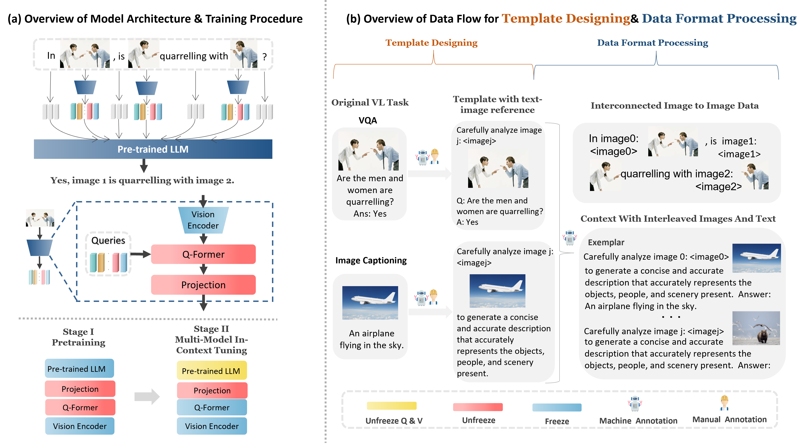

# News 🚀
1. [09-19] We have converted the MMICL demo to a permanent link: [Demo for MMICL](http://www.testmmicl.work). The Vicuna version of MMICL and Chat Mode are presently under development, so they may require careful adjustment of generation parameters and may not work correctly.
2. [09-15] Our [paper](https://arxiv.org/abs/2309.07915) has been uploaded to arXiv.
3. [09-01] The [MIC](https://huggingface.co/datasets/BleachNick/MIC_full) data(**both jsonl files and most image data**) has released on the huggingface hub. **Because of a network issue, the [MIC](https://www.modelscope.cn/datasets/BleachNick/MIC/) data, which includes jsonl files and corresponding image files for most datasets, has also been released on ModelScope.**
4. [08-23] Reach the 1st on [MME](https://github.com/BradyFU/Awesome-Multimodal-Large-Language-Models/tree/Evaluation), 1st on [MMBench](https://opencompass.org.cn/leaderboard-multimodal)
5. [08-21] The [MMICL-FLANT5XXL](https://huggingface.co/BleachNick/MMICL-Instructblip-T5-xxl) and [MMICL-Tiny](https://huggingface.co/BleachNick/MMICL-Instructblip-T5-xl) model has released on the huggingface hub.
   
## MMICL 
 **MMICL(Multi-Modal In-Context Learning)** is a multimodal vision-language model that incorporates blip2/instrcutblip. It has the ability to analyze and understand multiple images, as well as follow instructions. MMICL outperforms the VL model of the same size and performs exceptionally well on complex visual reasoning datasets. It achieves **state-of-the-art** performance on both multimodal task leaderboards and a
wide range of vision-language tasks. Furthermore, it showcases new capabilities in video understanding and multimodal in-context learning (M-ICL). 

 🔥 Further details of model and dataset will be released ASAP. 

 
 **Model**: [MMICL-FLANT5XXL](https://huggingface.co/BleachNick/MMICL-Instructblip-T5-xxl);  [MMICL-Tiny](https://huggingface.co/BleachNick/MMICL-Instructblip-T5-xl)

 **Data**: [MIC_5M](https://huggingface.co/datasets/BleachNick/MIC_full); [MIC_Sampled](https://huggingface.co/datasets/BleachNick/MIC_sampled) 
 
**Demo for MMICL**: [playground for MMICL-FLANT5XXL](http://testmmicl.work)

+ <mark>**Capability of multiple images refering and reasoning**<mark>

+ <mark>**Manually constructed In-context instruction tuning dataset**<mark>

+ Till 21st Aug. 2023 **1st on [MME](https://github.com/BradyFU/Awesome-Multimodal-Large-Language-Models/tree/Evaluation), 1st on [MMBench](https://opencompass.org.cn/leaderboard-multimodal)**

+ Visual Encoder:  VIT-L from CLIP/ ViT-G/14 from EVA-CLIP 

+ Pre-trained LLM: FlanT5-XL/ FlanT5-XXL/ Vicuna-7B/ Vicuna-13B


## Performance

### [MME](https://github.com/BradyFU/Awesome-Multimodal-Large-Language-Models/tree/Evaluation)

|       |**Perception(Overall)**| Existence| Count | Position |   Color     | Posters | Celebrity | Scene    | Landmark | Artwork | OCR   |
|-------|------------|-----------|--------|----------|-------|---------|-----------|-------|----------|---------|-------|
| SCORE | **1376.00**| 175.00    | 143.33 | 73.33   | **171.67**   | 130.95  | 145.88    | 152.75   | 135.08   | 133.00   | 115.00 |
| RANK  | **1**       | 4        | 2     | 5        | **1**         | 7      | 3         | 6         | 8        | 3       | 2     |


|       | **Cognition(Overall)** | Commonsense Reasoning | Numerical Calculation | Text Translation | Code Reasoning |
|-------|-----------|-----------------------|-----------------------|------------------|----------------|
| SCORE | **360.36**    | 117.86                | 62.50                    | **107.50**               | 72.50           |
| RANK  | **1**         | 2                     | 5                     | **1**                | 4              |


### [MMBench](https://opencompass.org.cn/leaderboard-multimodal)
+ test set
  
| Method  | Vision Model | Language Model | Overall  | LR    | AR     | RR    | FP-S | FP-C  | CP     |
|---------|--------------|----------------|----------|-------|--------|-------|------|-------|--------|
| MMICL   | EVA-G        | FLANT5-XXL     | **65.2**    | 44.3 | **77.9**  | **64.8** | **66.5** | **53.6**  |  **70.6** |
| [JiuTian](https://github.com/rshaojimmy/JiuTian) | EVA-G        | FLANT5-XXL     | 64.7     | 46.6  | 76.5   | 66.7  | 66.5 | 51.6  | 68.7   |

+ dev set
  
| Method  | Vision Model | Language Model | Overall  | LR    | AR     | RR    | FP-S | FP-C  | CP     |
|---------|--------------|----------------|----------|-------|--------|-------|------|-------|--------|
| MMICL   | EVA-G        | FLANT5-XXL     | **67.9**    | **49.2** | **77.9**  | **73.0** | 66.7 | 57.2  |  **77.2** |
| [JiuTian](https://github.com/rshaojimmy/JiuTian) | EVA-G        | FLANT5-XXL     | 67.1     | 46.7  | 69.7   | 71.3  | 67.3 | 58.6  | 75.8   |


## Reproduce Tips
Since experiments reported in our paper are all conducted on NVIDIA DGX-A40 servers (which might be difficult to acquire), 
we reimplement MMICL with:

* Ubuntu servers with 4/6* NVIDIA GeForce A40 (46G) GPUs
* Install Apex to enable the bf16 training and evaluation
* Cuda 11.3, deepspeed to enable the zero2-offload and zero3 training
* Packages with certain versions (provided below)

### Setup
We conduct our experiment with Anaconda3. If you have installed Anaconda3, then create the environment for MMICL:

```shell
conda env create -f environment.yml
```


### MIC Data
Using multiple data source such as: VCR, VQAv2, GQA, COCO, NLVR2, OKVQK, FILCKR, STVQA, MSRVTT, MSRVTTQA, TextVQA, RefCOCO, WikiArt, DiffusionDB, VSR, LLaVa-Instruct, MiniImagenet
We tranform it into few shot style and stored it into jsonl files:
It forms the all data in to multi instruction style with zero to few-shot form data.
runing the preprocessed script and change the data into raw arrow file for further training:
```shell
# The detail of MIC dataset will be added ASAP
python data_preprocess.py
```
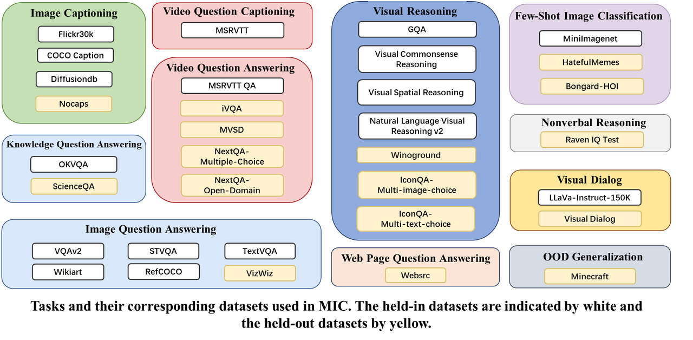
####  Format
```
1. Interleaved Image-Text Data

Input:  Image 0 is <image0> {image 0}
        ...
        Image j is <imagej> {image j}
        {question}

MMICL:  {answer}

2. In−Context Demonstration Data

Input:  Image 0 is <image0> {image 0}.
        {question} 
        {answer} 
        ...
        Image j is <imagej> {image j}.
        {question} 

MMICL:  {answer}
 ```
- interleaved image text example
 

 - relevant image example
 

 - in context example
 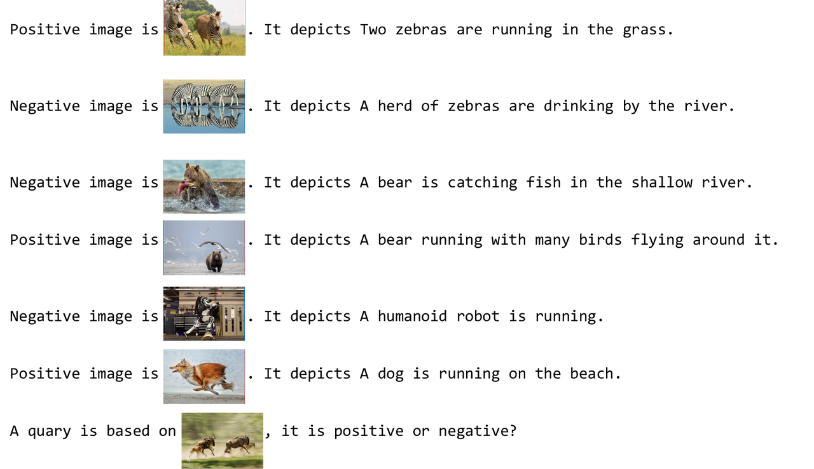

### Examples
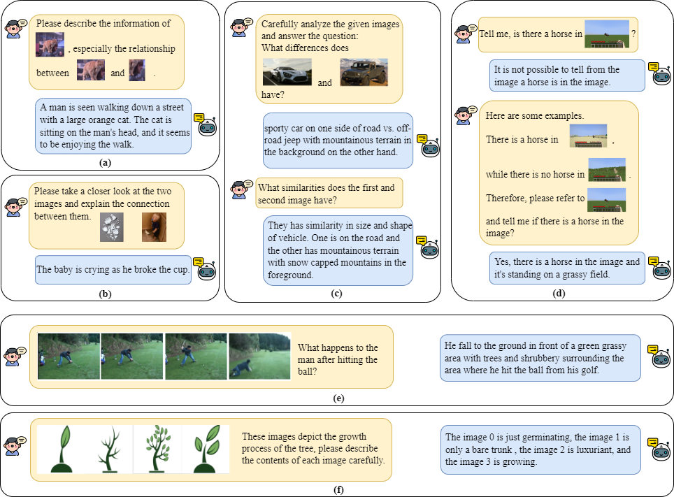

### Model Structure


### Training
Run training scripts in [run_script](run_script) :

```shell
# For training the MMICL in FLANT5-xxl version
bash run_script/flickr/deep_speed_instructblip_t5xxl.sh
```
### Inference


```
# For T5 based model
from model.instructblip import InstructBlipConfig, InstructBlipModel, InstructBlipPreTrainedModel,InstructBlipForConditionalGeneration,InstructBlipProcessor
import datasets
import json
import transformers
from PIL import Image
import torch
model_type="instructblip"
model_ckpt="BleachNick/MMICL-Instructblip-T5-xxl"
processor_ckpt = "Salesforce/instructblip-flan-t5-xxl"
config = InstructBlipConfig.from_pretrained(model_ckpt )

if 'instructblip' in model_type:
    model = InstructBlipForConditionalGeneration.from_pretrained(
        model_ckpt,
        config=config).to('cuda:0',dtype=torch.bfloat16) 

image_palceholder="图"
sp = [image_palceholder]+[f"<image{i}>" for i in range(20)]
processor = InstructBlipProcessor.from_pretrained(
    processor_ckpt
)
sp = sp+processor.tokenizer.additional_special_tokens[len(sp):]
processor.tokenizer.add_special_tokens({'additional_special_tokens':sp})
if model.qformer.embeddings.word_embeddings.weight.shape[0] != len(processor.qformer_tokenizer):
    model.qformer.resize_token_embeddings(len(processor.qformer_tokenizer))
replace_token="".join(32*[image_palceholder])
```
#### Images:
<p align="center">
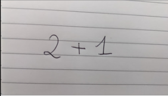
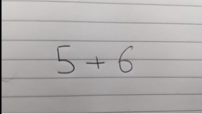
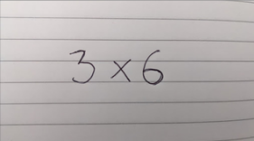
</p>

```
image = Image.open ("images/cal_num1.png")
image1 = Image.open ("images/cal_num2.png")
image2 = Image.open ("images/cal_num3.png")
images = [image,image1,image2]

prompt = [f'Use the image 0: <image0>{replace_token},image 1: <image1>{replace_token} and image 2: <image2>{replace_token} as a visual aid to help you calculate the equation accurately. image 0 is 2+1=3.\nimage 1 is 5+6=11.\nimage 2 is"']
prompt = " ".join(prompt)

inputs = processor(images=images, text=prompt, return_tensors="pt")

inputs['pixel_values'] = inputs['pixel_values'].to(torch.bfloat16)
inputs['img_mask'] = torch.tensor([[1 for i in range(len(images))]])
inputs['pixel_values'] = inputs['pixel_values'].unsqueeze(0)

inputs = inputs.to('cuda:0')
outputs = model.generate(
        pixel_values = inputs['pixel_values'],
        input_ids = inputs['input_ids'],
        attention_mask = inputs['attention_mask'],
        img_mask = inputs['img_mask'],
        do_sample=False,
        max_length=50,
        min_length=1,
        set_min_padding_size =False,
)
generated_text = processor.batch_decode(outputs, skip_special_tokens=True)[0].strip()
print(generated_text)

```
#### Output:

        3x6=18"

#### Images:
<p align="center">
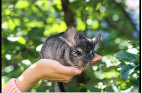
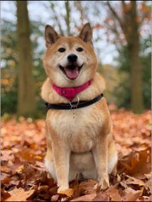
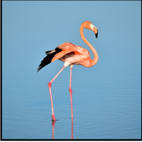
</p>

```
image = Image.open ("images/chinchilla.png")
image1 = Image.open ("images/shiba.png")
image2 = Image.open ("images/flamingo.png")
images = [image,image1,image2]
images = [image,image1,image2]
prompt = [f'image 0 is <image0>{replace_token},image 1 is <image1>{replace_token},image 2 is <image2>{replace_token}. Question: <image0> is a chinchilla. They are mainly found in Chile.\n Question: <image1> is a shiba. They are very popular in Japan.\nQuestion: image 2 is']

prompt = " ".join(prompt)

inputs = processor(images=images, text=prompt, return_tensors="pt")

inputs['pixel_values'] = inputs['pixel_values'].to(torch.bfloat16)
inputs['img_mask'] = torch.tensor([[1 for i in range(len(images))]])
inputs['pixel_values'] = inputs['pixel_values'].unsqueeze(0)

inputs = inputs.to('cuda:0')
outputs = model.generate(
        pixel_values = inputs['pixel_values'],
        input_ids = inputs['input_ids'],
        attention_mask = inputs['attention_mask'],
        img_mask = inputs['img_mask'],
        do_sample=False,
        max_length=50,
        min_length=1,
        set_min_padding_size =False,
)
generated_text = processor.batch_decode(outputs, skip_special_tokens=True)[0].strip()
print(generated_text)


```
#### Output:

       a flamingo. They are native to South America and are known for their bright red plumage and distinctive call.


#### Images:

<p align="center">
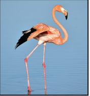

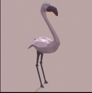
</p>

```

image = Image.open ("images/flamingo_photo.png")
image1 = Image.open ("images/flamingo_cartoon.png")
image2 = Image.open ("images/flamingo_3d.png")

images = [image,image1,image2]
prompt = [f'Use the image 0: <image0>{replace_token}, image 1: <image1>{replace_token} and image 2: <image2>{replace_token} as a visual aids to help you answer the question. Question: Give the reason why image 0, image 1 and image 2 are different? Answer:']

prompt = " ".join(prompt)

inputs = processor(images=images, text=prompt, return_tensors="pt")

inputs['pixel_values'] = inputs['pixel_values'].to(torch.bfloat16)
inputs['img_mask'] = torch.tensor([[1 for i in range(len(images))]])
inputs['pixel_values'] = inputs['pixel_values'].unsqueeze(0)

inputs = inputs.to('cuda:0')
outputs = model.generate(
        pixel_values = inputs['pixel_values'],
        input_ids = inputs['input_ids'],
        attention_mask = inputs['attention_mask'],
        img_mask = inputs['img_mask'],
        do_sample=False,
        max_length=80,
        min_length=50,
        num_beams=8,
        set_min_padding_size =False,
)
generated_text = processor.batch_decode(outputs, skip_special_tokens=True)[0].strip()
print(generated_text)


```
Output:

       image 0 is a photo of a flamingo standing in the water, image 1 is a cartoon drawing of a flamingo and image 2 is a low polygon count 3d model animation


## Reference
<br> **📑 If you find our projects helpful to your research, please consider citing:** <br>
```
@article{zhao2023mmicl,
  title={MMICL: Empowering Vision-language Model with Multi-Modal In-Context Learning},
  author={Zhao, Haozhe and Cai, Zefan and Si, Shuzheng and Ma, Xiaojian and An, Kaikai and Chen, Liang and Liu, Zixuan and Wang, Sheng and Han, Wenjuan and Chang, Baobao},
  journal={arXiv preprint arXiv:2309.07915},
  year={2023}
}
```

