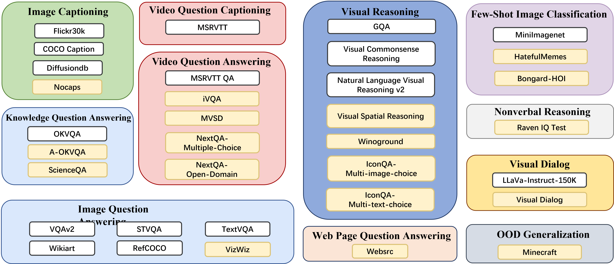

# MIC 
Visual Language Models (VLMs) have made significant progress in various downstream tasks by developing large-scale multimodal models. However, they sometimes lack reasoning and contextual learning abilities. On the other hand, Large Language Models (LLMs) have revolutionized the NLP community with their strong reasoning and contextual learning capabilities. LLMs can quickly adapt to new tasks involving inference without fine-tuning pre-trained models or parameter updates, such as question answering and commonsense reasoning.

Studying in context learning abilities contributes to VLMs' ability to generalize new knowledge in lifelong learning environments, develop learnable capabilities, and advance artificial intelligence skills. Therefore, we propose the MIC dataset. This is a manually constructed instruction tuning dataset supports interleaved text-image inputs, inter-related multiple image inputs, and multimodal in-context learning inputs. By finetuning VLMs on MIC, we enable them to possess multimodal in-context learning capabilities and understand complex relationships between instructions and multiple images.

## MMICL 
 MMICL is a multimodal vision-language model that incorporates blip2/instrcutblip. It has the ability to analyze and understand multiple images, as well as follow instructions. MMICL outperforms the VL model of the same size and performs exceptionally well on complex visual reasoning datasets. It achieves state-of-the-art performance on various multimodal task leaderboards. Furthermore, it showcases new capabilities in video understanding and multimodal in-context learning (M-ICL). 

 🔥 Further details of model and dataset will be released ASAP. 


+ Visual Encoder:  VIT-L from CLIP/ ViT-G/14 from EVA-CLIP 


+ Pre-trained LLM: FlanT5-XL/ FlanT5-XXL/ Vicuna-7B/ Vicuna-13B

+ <mark>**Capability of multiple images refering and reasoning**<mark>

+ <mark>**Manually constructed In-context instruction tuning dataset**<mark>

+ <mark>**1st on [MMBench](https://opencompass.org.cn/leaderboard-multimodal), 1st on Cognition of [MME](https://github.com/BradyFU/Awesome-Multimodal-Large-Language-Models/tree/Evaluation) and 2nd on Perception of[MME](https://github.com/BradyFU/Awesome-Multimodal-Large-Language-Models/tree/Evaluation)**<mark>

## Performance

### [MMBench](https://opencompass.org.cn/leaderboard-multimodal)

| Method  | Vision Model | Language Model | Overall  | LR    | AR     | RR    | FP-S | FP-C  | CP     |
|---------|--------------|----------------|----------|-------|--------|-------|------|-------|--------|
| MMICL   | EVA-G        | FLANT5-XXL     | **65.24**    | 44.32 | **77.85**  | **64.78** | **66.5** | **53.6**  |  **70.64** |
| [JiuTian](https://github.com/rshaojimmy/JiuTian) | EVA-G        | FLANT5-XXL     | 64.7     | 46.6  | 76.5   | 66.7  | 66.5 | 51.6  | 68.7   |

### [MME](https://github.com/BradyFU/Awesome-Multimodal-Large-Language-Models/tree/Evaluation)

|       | Cognition | Commonsense Reasoning | Numerical Calculation | Text Translation | Code Reasoning |
|-------|-----------|-----------------------|-----------------------|------------------|----------------|
| SCORE | **338.93**    | 121.43                | 65                    | 85               | 67.5           |
| RANK  | **1**         | 2                     | 4                     | 2                | 6              |


|       | Perception | Existence | Count  | Position | Color | Posters | Celebrity | Scene | Landmark | Artwork | OCR   |
|-------|------------|-----------|--------|----------|-------|---------|-----------|-------|----------|---------|-------|
| SCORE | 1367.56    | 170       | **153.33** | 80       | **170**   | 118.71  | 145.59    | 154   | 142.93   | 120.5   | 112.5 |
| RANK  | 2          | 4         | **1**      | 4        | **1**     | 9      | 3         | 5     | 5        | 4       | 2     |


## Reproduce Tips
Since experiments reported in our paper are all conducted on NVIDIA DGX-A40 servers (which might be difficult to acquire), 
we reimplement MMICL with:

* Ubuntu servers with 6* NVIDIA GeForce A40 (46G) GPUs 
* cuda 11.3
* packages with certain versions (provided below)

### Setup
We conduct our experiment with Anaconda3. If you have installed Anaconda3, then create the environment for MMICL:

```shell
conda create -n vlprompt python=3.8.5
conda activate vlprompt
```

After we setup basic conda environment, install pytorch related packages via:

Finally, install other python packages we need:

```shell
pip install -r requirements.txt
```

### Data
Using multiple data source such as: VCR, VQAv2, GQA, COCO, NLVR2, OKVQK, FILCKR, STVQA, MSRVTT, MSRVTTQA, TextVQA, RefCOCO, WikiArt, DiffusionDB, VSR, LLaVa-Instruct, MiniImagenet
We tranform it into few shot style and stored it into jsonl files:
It forms the all data in to multi instruction style with zero to few-shot form data.
runing the preprocessed script and change the data into raw arrow file for further training:
```shell
python data_preprocess.py
```

####  Format
```
1. Interleaved Image-Text Data

Input:  Image 0 is <image0> {image 0}
        ...
        Image j is <imagej> {image j}
        {question}

MMICL:  {answer}

2. In−Context Demonstration Data

Input:  Image 0 is <image0> {image 0}.
        {question} 
        {answer} 
        ...
        Image j is <imagej> {image j}.
        {question} 

MMICL:  {answer}
 ```
- interleaved image text example
 

 - relevant image example
 

 - in context example
 
### Training
Run training scripts in [run_script](run_script) :

```shell
bash run_script/flickr/deep_speed_instructblip_t5xxl.sh
```
### Inference

```
# For T5 based model
from model.instructblip import InstructBlipConfig, InstructBlipModel, InstructBlipPreTrainedModel,InstructBlipForConditionalGeneration,InstructBlipProcessor
import datasets
import json
import transformers
from PIL import Image
import torch
from model.blip2 import Blip2Processor,Blip2ForConditionalGeneration
from model.blip2 import Blip2Config
model_type="instructblip"
model_ckpt="Salesforce/instructblip-flan-t5-xl"

if 'blip2' in model_type:
    model = Blip2ForConditionalGeneration.from_pretrained(
            model_ckpt,
            config=config).to('cuda:0',dtype=torch.bfloat16)
elif 'instructblip' in model_type:
    model = InstructBlipForConditionalGeneration.from_pretrained(
        model_ckpt,
        config=config).to('cuda:0',dtype=torch.bfloat16) 


sp = ["图"]+[f"<image{i}>" for i in range(20)]

processor = InstructBlipProcessor.from_pretrained(
    model_ckpt
)
# processor = Blip2Processor.from_pretrained(
#     model_ckpt
# )

sp = sp+processor.tokenizer.additional_special_tokens[len(sp):]
processor.tokenizer.add_special_tokens({'additional_special_tokens':sp})


prompt = ['Use the image 0: <image0>图,image 1: <image1>图 and image 2: <image2>图 as a visual aid to help you calculate the equation accurately. image 0 is 2+1=3.\nimage 1 is 5+6=11.\nimage 2 is"']

prompt = " ".join(prompt)

inputs = processor(images=images, text=prompt, return_tensors="pt")

inputs['pixel_values'] = inputs['pixel_values'].to(torch.bfloat16)
inputs['img_mask'] = torch.tensor([[1 for i in range(len(images))]])
inputs['pixel_values'] = inputs['pixel_values'].unsqueeze(0)

inputs = inputs.to('cuda:0')
outputs = model.generate(
        pixel_values = inputs['pixel_values'],
        input_ids = inputs['input_ids'],
        attention_mask = inputs['attention_mask'],
        img_mask = inputs['img_mask']
)
generated_text = processor.batch_decode(outputs, skip_special_tokens=True)[0].strip()
print(generated_text)

```


